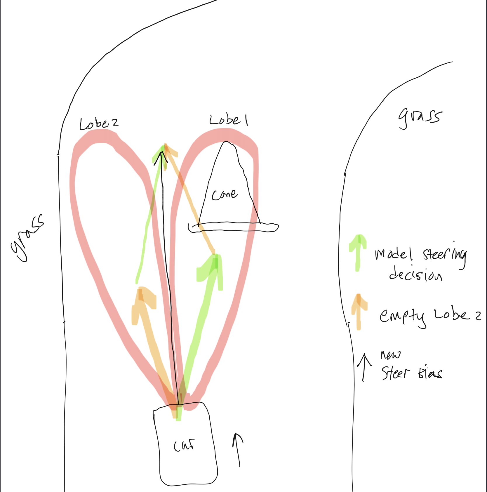

# Jetsim Lidar feature
**Summary:** This branch of Jetsim is dedicated to the donkeycar simulators lidar sensor.

To install from scratch, follow the [*develop* branch README.md](https://github.com/Triton-AI/jetsim/blob/develop/README.md)

---

---

Installation & Usage Process
===
