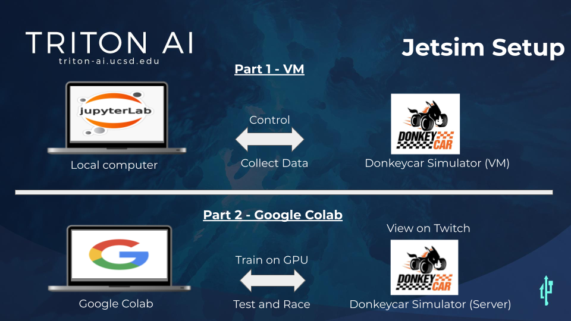
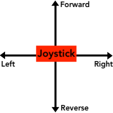

# Jetsim Workshop
**Summary:** This branch of Jetsim will show you how to use NVIDIA's Jetracer framework with VM Ubuntu and Google Colab.

---

Installation & Training Process
===

### **Step 0** - Make a folder for this repository branch on your VM computer and enter into the folder:

- `cd ~/projects`
- `mkdir jetracer_jetsim`
- `cd jetracer_jetsim`

---

### **Step 1** - Git clone **jetsim** branch to your new folder

- `git clone https://github.com/Triton-AI/jetsim.git`
- `cd jetsim`
- `git checkout cosmosc11`

### **Step 2** - Activate environment and install necessary packages
- `conda activate donkey`
- `pip install jupyterlab`
- `pip install ipywidgets`
- `pip install matplotlib`
- `pip install ipycanvas`

---

### **Step 3** - Collect data on your VM computer/simulator:

- Make sure you are in the correct directory.
- `pwd` 
- on the terminal, you should see`'/home/ucsd/projects/jetracer_jetsim/jetsim'`
- Now run this command in the terminal:
- `jupyter-lab` 
- This should redirect you to a web-browser.
- Click into the **jetsim_vm** folder and open **JETSIM_collect_images**

#### We will be using method 2 for the COSMOS Program

#### Follow the instructions in the notebook

- Verify **m2_images** folder is cleaned up with correct data
- cd into m2_images and check for anyhting that is not a jpg.
- `ls -a`
- remove anything not jpg.
- zip the folder or skip if already zipped from notebook:
- `zip -r m2_images.zip m2_images`

---

### **Step 4.1** - Trasfer and prepare **Google Drive** for Jetsim Colab training:

- Transfer **jetsim_googlecolab** folder into your **Google drive** main directory.
### !!!

- **Transfer image zipped file into **Google Drive/jetsim_googlecolab/SIM_road_following_A** directory folder.**

### !!!
- Install [Google Colaboratory](https://colab.research.google.com/notebooks/intro.ipynb) for your **Google drive**.

### **Step 4.2** - Jetsim Colab training:

- Right click and open **JETSIM_interactive_regression.ipynb** in Google Colab application.
   - NOTE: Be sure to navigate to 'Edit/Notebook settings' Google Colab toolbar and select GPU before training cell. 
- Operate **JETSIM_interactive_regression.ipynb** to train Pytorch model **(.pth)**
- Move new Pytorch model **(.pth)** into **models** folder inside **Google Dirve**.

---

### **Step 5** - Test and race your jetsim model on the DIY Robocar virtual track server.

- Right click and open **JETSIM_road_following.ipynb** in Google Colab application.
    - NOTE: Be sure to install **gym-donkeycar** repository into your **Google Drive**, AND move **components.py** and **gym-interface.py** into the **gym-donkecyar** folder as instructed in the **JETSIM_road_following.ipynb**. Othersise you get a donkeycar related error.
- Operate **JETSIM_road_following.ipynb** to test Pytorch model **(.pth)**
- Watch LIVE performance on [Twitch feed](https://www.twitch.tv/roboticists2)
- Calibrate as necessary to improve model performance.

FINISHED
===

**Jetracer Terminology:**

**Jetracer** is a [NIVIDA open source](https://github.com/abritten/jetracer) road following algorithm. It is software that can be used on any kind of car using a Jetson Nano GPU.

**Jetsim** is a folder containing the Jetracer algorithm but can can interface with the Donkeycar simulator. Triton AI has developed this desktop computer version to take it off the Jetson Nano.

**"jetsim" Environment** is the Jetracer environment for a desktop computer. Triton AI is developing this now so that Jetsim can run in this desktop virtual environments. This should be built using conda. 

**jetsim-local** is the Jetsim local folder and needed files for a desktop computer. This will connect with your local Donkeycar simulator for driving manually and collecting data only.  

**jetsim-google-colab** is the Jetsim folder and needed files for a Google Drive setup. This will allow you to train on Colab GPU's and connect you to the virtual race track to test and race your model.  

**Jetcard** is a [flashed image](https://github.com/NVIDIA-AI-IOT/jetcard) with the Jetracer environment. This is ONLY used for SD cards for the Jetson Nanos to run Jetracer.

**Jetson Nano** is a small developer kit CPU with CUDA GPU programming capabilites. It typically runs Ubuntu 18.04 on arm64. Most applications do not work on arm64.

**gym-donkeycar** is the [OpenAI gym environment](https://github.com/tawnkramer/gym-donkeycar) to interface a AI framewrok with the Donkeycar similator. 

**Donkeycar simulator** like a video game, simulates a 3D car that can take control inputs and return images. This Jetsim will work with the latest version [Race Edition 21.04.15](https://github.com/tawnkramer/gym-donkeycar/releases/tag/v21.04.15)

---
