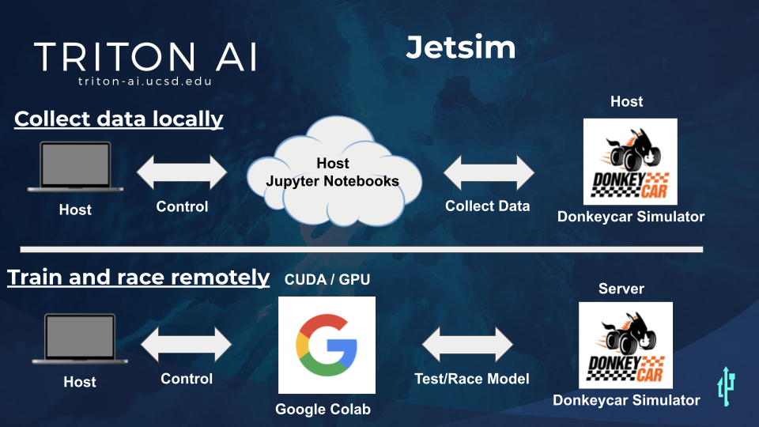

# Jetsim Workshop

.. image:: https://mybinder.org/badge_logo.svg
 :target: https://mybinder.org/v2/gh/Triton-AI/jetsim.git/workshop
**Summary:** This branch of Jetsim will show you how to use NVIDIA's Jetracer framework within the Google Colaboratory environment: Collect and train data from the [Donkeycar simulator](https://github.com/tawnkramer/gym-donkeycar/releases) and build an autonomous driving model that can race in virtual tournaments.

### Watch Jetsim perform for the first time in the finals of the DIY Robocar Virtual Tournament

---

Installation & Training Process
===

### [Tutorial video]()

### **Step 0** - Make a folder for this repository branch on your computer:

- cd into the new folder via terminal.

---

### **Step 1** - Git clone **jetsim** branch to your new folder:

      git clone https://github.com/Triton-AI/jetsim.git

      cd jetsim

      pip install docopt pyserial opencv-python pygame==2.0.0.dev10 matplotlib ipycanvas

      conda install -c anaconda ipykernel

      python -m ipykernel install --user --name=jetsim

- Git clone **gym-donkeycar** interface repository.

      git clone https://github.com/tawnkramer/gym-donkeycar

- Install **gym-donkeycar** interface with ONLY ONE of these lines of code (Machine specific)
  
      pip install -e .[gym-donkeycar] #Windows ONLY
      pip install -e gym-donkeycar #Mac ONLY
      python3 -m pip install -e .[gym-donkeycar] --user #linux ONLY

- Go to **jetsim-local** directory.

      cd ../jetsim_local

### Finally download latest [Donkeycar Simulator](https://github.com/tawnkramer/gym-donkeycar/releases) for you specific machine (Mac, PC, or Linux)

---

### **Step 3.1** - Collect data LOCALLY on your computer/simulator:

- Use [VScode](https://code.visualstudio.com/) IDE to operate all Jupyter Notebooks from this point on. Or use [Anaconda Navaigator](https://docs.anaconda.com/anaconda/install/) with Jupyter Labs IDE to operate all Jupyter Notebooks. Either one will work as long as you activate your "jetsim" environment for each Notebook. 
- Navigate to **jetsim_local** folder with your IDE (side menu that navigates folder directories)
- Operate **JETSIM_collect_images.ipynb** to collect data.
  - NOTE: Activate "jetsim" environment for Jupyter Notebook.
  
### **Step 3.2** - Rename data (for **Method 1**):
- Rename all collected data with post processing. 

      python postprocess_images.py

- Verify **m1_images** folder is cleaned up with correct data.
- Compress images folder:
      
      zip -r m1_images.zip images

### If **Method 2** was used:
- Verify **m2_images** folder is cleaned up with correct data
- Compress images folder:
      
      zip -r m2_images.zip images

---

### **Step 4.1** - Trasfer and prepare **Google Drive** for Jetsim Colab training:

- Trasnfer **jetsim_googlecolab** folder into your **Google drive** main directory.
### !!!

- Transfer (compressed) **zip** folder into **Google Drive/jetsim_googlecolab/SIM_road_following_A** directoy folder.

### !!!
- Install [Google Colaboratory](https://colab.research.google.com/notebooks/intro.ipynb) for your **Google drive**.

### **Step 4.2** - Jetsim Colab training:

- Right click and open **JETSIM_interactive_regression.ipynb** in Google Colab application.
   - NOTE: Be sure to navigate to 'Edit/Notebook settings' Google Colab toolbar and select GPU before training cell. 
- Operate **JETSIM_interactive_regression.ipynb** to train Pytorch model **(.pth)**
- Move new Pytorch model **(.pth)** into **models** folder inside **Google Dirve**.

---

### **Step 5** - Test and race your jetsim model on the DIY Robocar virtual track server.

- Right click and open **JETSIM_road_following.ipynb** in Google Colab application.
    - NOTE: Be sure to install **gym-donkeycar** repository into your **Google Drive**, AND move **components.py** and **gym-interface.py** into the **gym-donkecyar** folder as instructed in the **JETSIM_road_following.ipynb**. Othersise you get a donkeycar related error.
- Operate **JETSIM_road_following.ipynb** to test Pytorch model **(.pth)**
- Watch LIVE performance on [Twitch feed](https://www.twitch.tv/roboticists)
- Calibrate as necessary to improve model performance.

FINISHED
===

**Jetracer Terminology:**

**Jetracer** is a [NIVIDA open source](https://github.com/abritten/jetracer) road following algorithm. It is software that can be used on any kind of car using a Jetson Nano GPU.

**Jetsim** is a folder containing the Jetracer algorithm but can can interface with the Donkeycar simulator. Triton AI has developed this desktop computer version to take it off the Jetson Nano.

**"jetsim" Environment** is the Jetracer environment for a desktop computer. Triton AI is developing this now so that Jetsim can run in this desktop virtual environments. This should be built using conda. 

**jetsim-local** is the Jetsim local folder and needed files for a desktop computer. This will connect with your local Donkeycar simulator for driving manually and collecting data only.  

**jetsim-google-colab** is the Jetsim folder and needed files for a Google Drive setup. This will allow you to train on Colab GPU's and connect you to the virtual race track to test and race your model.  

**Jetcard** is a [flashed image](https://github.com/NVIDIA-AI-IOT/jetcard) with the Jetracer environment. This is ONLY used for SD cards for the Jetson Nanos to run Jetracer.

**Jetson Nano** is a small developer kit CPU with CUDA GPU programming capabilites. It typically runs Ubuntu 18.04 on arm64. Most applications do not work on arm64.

**gym-donkeycar** is the [OpenAI gym environment](https://github.com/tawnkramer/gym-donkeycar) to interface a AI framewrok with the Donkeycar similator. 

**Donkeycar simulator** like a video game, simulates a 3D car that can take control inputs and return images. This Jetsim will work with the latest version [Race Edition 21.04.15](https://github.com/tawnkramer/gym-donkeycar/releases/tag/v21.04.15)

---
