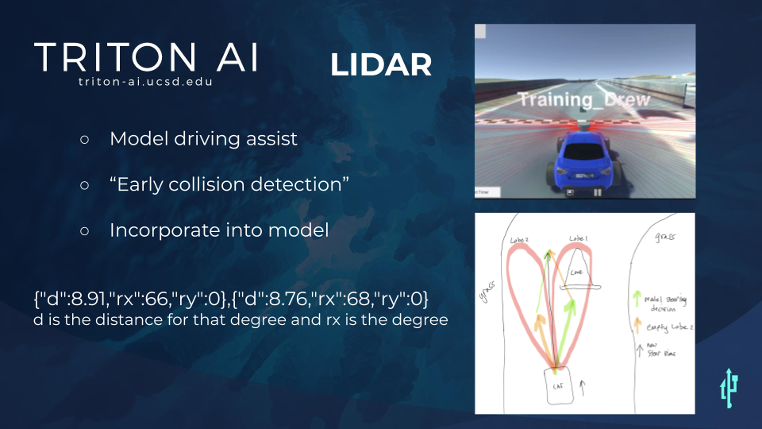

# Jetsim Lidar feature
**Summary:** This branch of Jetsim is dedicated to the donkeycar simulators lidar sensor.

To install from scratch, follow the [*develop* branch README.md](https://github.com/Triton-AI/jetsim/blob/develop/README.md)

---

---

Installation & Usage Process

Installation is the same as the master branch. Make sure to use road_following from this branch in order to use Lidar.

1. Go to "Create the racecar dictionary." Look at the "lidar" section. Set "enabled" to True and configure the two other parameters (deg_inc, and max_range) if desired.
   1. "enabled" determines whether or Lidar is activated. True for enabled and False for disabled.
   2. "deg_inc" is the distance in terms of degrees (integer) between each ray of Lidar. Ideally, this should be set to 1, but it is currently set to 5 for bug fixes.
   3. "max_range" is the maximum range that the Lidar detects objects. This value is map specific. It is defaulted to 30 for the warren track. Setting this value too high will make the car add unnecessary steering bias, but setting this value too low will cause Lidar to not detect an approaching object.
2. Go to "Run the model." Look at the "LIDAR" section of constants. Configure the three parameters (DEG_RANGE, MAX_STEER_BIAS, and AVE_THRESHOLD) if desired.
   1. DEG_RANGE is the range of the lobes in terms of degrees from the forward axis in the X direction. So, the left lobe has the interval: (-DEG_RANGE, 0) and the right lobe has the interval: (0, DEG_RANGE). Defaulted to 30.
   2. MAX_STEER_BIAS is the intensity that the car should steer upon detecting an object (Should not equal STEERING GAIN). Defaulted to 3.0.
   3. AVE_THRESHOLD is the threshold in which the average values of the lobes need to reach in order to add extra steer bias. This value should be increased if LIDAR_FAR_DISTANCE increases and decreased if LIDAR_FAR_DISTANCE decreases.
3. Make sure LIDAR_FAR_DISTANCE is the same as "max_range."
4.  Make sure DEGREE_INC is the same as "deg_inc."
5.  After that, follow the same steps as in the JetSim master branch to run JetSim with Lidar object avoidance!

===
